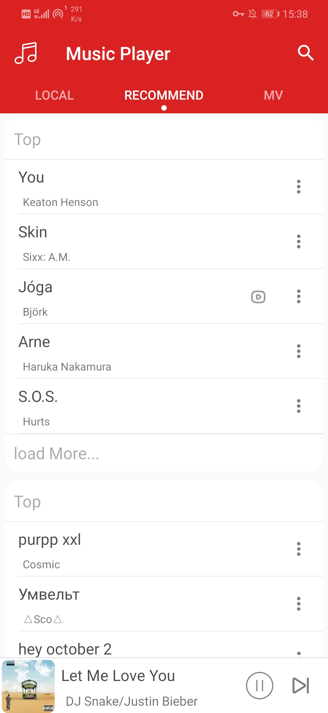

# Music Player（Unfinished）
This is a music player using the MVVM(view--viewmodel--model), Network Api comes from [NeteaseCloudMusicApi](https://binaryify.github.io/NeteaseCloudMusicApi/#/?id=neteasecloudmusicapi).

## Technology stack And Open source framework

* MVVM
* Kotlin
* DataBinding
* Rxjava2
* Retrofit2
* Room
* Koin
* ViewModel
* Gson
* Dachshund-Tab-Layout
* EventBus
* Glide
* Flexbox

## Reference : Ui effect
* [PaoNet](https://github.com/ditclear/PaoNet) -> RecyclerView's Base Activity
* [KotlinMvp](https://github.com/git-xuhao/KotlinMvp) -> Search Activity Transition Animation

## TODO => Apply : 
* Ijkplayer

* And so on

## Local Load Strategy
Content Providers, App DataBase(playTime >= 60s)to get local music. 
Synchronize of database is search online resources to adapter local Content Providers' Music and add it to local App database.

